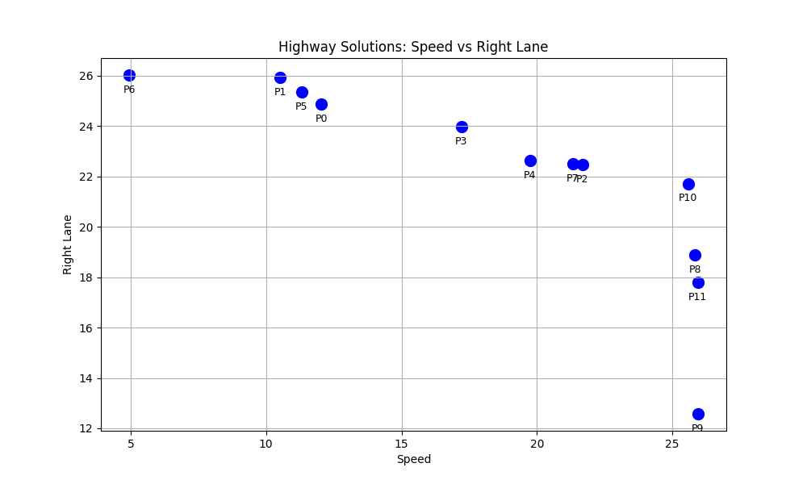

# Navigating Trade-offs: Policy Summarization for Multi-Objective Reinforcement Learning
Official code repository for ["Navigating Trade-offs: Policy Summarization for Multi-Objective Reinforcement Learning (ECAI-2024)]().  

 
 
 


*A demo of the visual summary generated by the DISAGREEMENTS algorithm. The summary portrays the diffrence in behavior of two agents strating from the same state denoted by the text "Disagreement". The summary allows for a visual contrastive comparison between agent behaviors.* 


### Installation  
  
The project is based on Python 3.7. All the necessary packages are in requirements.txt.
Create a virtual environment and install the requirements using:
```
pip install -r requirements.txt
```

### Required repositories
The Highway domain implementation of the algorithm requires the following repositories:

[https://github.com/eleurent/highway-env](https://github.com/eleurent/highway-env) V1.4

[https://github.com/eleurent/rl-agents](https://github.com/eleurent/rl-agents)

### Adding a new domain
The code works by accessing an **interface** for each domain.
Adding a new domain requires a relevant interface and configuration file to be added to *disagreements/Interfaces* and *disagreements/configs* respectively.

### Running
The *configuration_dict* dictionary in *run_comparison.py* should be updated for any new agents or domains you wish to compare. 
```
python run_comparison.py -a1 ClearLane -a2 FastRight
```
